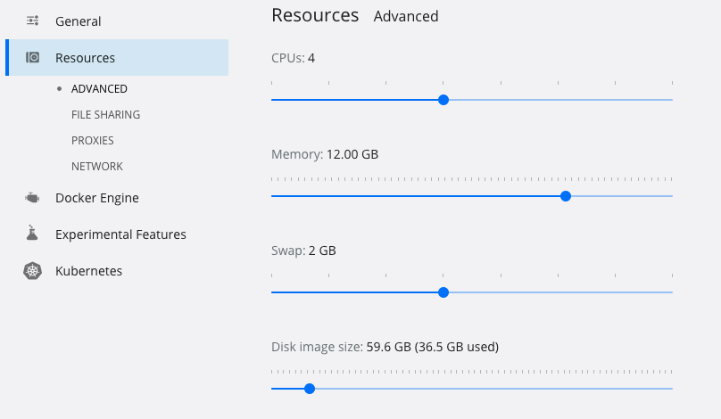

Cistrome ChiLin
================
It is a pipeline for processing ChIP-seq and DNase-seq data.

Docker version
================
1. Install docker for [your system](https://docs.docker.com/get-docker/)

2. Configure the memory, e.g., see 

3. Clone the repo,
```sh
git clone https://github.com/cfce/chilin
cd chilin
```

4. `docker pull qq06/chilin:1.0`. If network is not fast, user could build the docker image locally by `docker build -t chilin:1.0 .`

5. run the demo command
```sh
bash demo/docker_test.sh
```
6. copy the results out of docker, `docker cp container_id:/chilin/local .`

Manual install
===============
See if you have gcc, g++, java, R, python-dev installed (http://cistrome.org/chilin/Installation.html#dependent-software-list).

First, clone:

``` sh
git clone https://github.com/cfce/chilin
```

then install through with the system-wide python and pip, e.g., /usr/bin/python or /usr/local/bin/python,

``` sh
wget -c https://repo.anaconda.com/miniconda/Miniconda3-latest-Linux-x86_64.sh
bash Miniconda3-latest-Linux-x86_64.sh

conda create -n chilin_env python=2
conda activate chilin_env
conda config --add channels defaults
conda config --add channels conda-forge
conda config --add channels bioconda

conda install bwa=0.7.13 samtools=0.1.19 bedtools=2.17.0 seqtk ucsc-bedclip ucsc-bedgraphtobigwig ucsc-wigcorrelate ucsc-wigtobigwig fastqc numpy macs2=2.1.0 bioconductor-seqlogo 

easy_install pip
python setup.py install
```

source virtual environment and use:

``` sh
chilin -h
```

And download the reference files, and test on `demo/foxa1`.

``` sh
# change to default directory
mkdir -p db
cd db

# download mycoplasma for judgement of contamination in your samples
wget -c http://cistrome.org/chilin/_downloads/mycoplasma.tgz
wget -c http://cistrome.org/chilin/_downloads/mycoplasma.tgz.md5
md5sum -c mycoplasma.tgz.md5
tar xvfz mycoplasma.tgz

# http://cistrome.org/chilin/Appendix.html#get-dependent-data
# huge reference download
# hg38
wget -c http://cistrome.org/chilin/_downloads/hg38.tgz
wget -c http://cistrome.org/chilin/_downloads/hg38.tgz.md5 ## check md5
md5sum -c hg38.tgz
tar xvfz hg38.tgz

# hg19
wget -c http://cistrome.org/chilin/_downloads/hg19.tgz
wget -c http://cistrome.org/chilin/_downloads/hg19.tgz.md5 ## check md5
md5sum -c hg19.tgz
tar xvfz hg19.tgz

# mm9
wget -c http://cistrome.org/chilin/_downloads/mm9.tgz
wget -c http://cistrome.org/chilin/_downloads/mm9.tgz.md5 ## check md5
md5sum -c mm9.tgz
tar xvfz mm9.tgz

# mm10
wget -c http://cistrome.org/chilin/_downloads/mm10.tgz
wget -c http://cistrome.org/chilin/_downloads/mm10.tgz.md5 ## check md5
md5sum -c mm10.tgz
tar xvfz mm10.tgz

cd .. && python setup.py install
```

Usage
==============================

Demo data command is as follows:

```sh
cd demo && bash foxa1
```

``` sh
   chilin  simple -p narrow -t foxa1_t1.fastq  -c foxa1_c1.fastq -i local -o local -s hg19  --skip 10,12 --dont_remove
```

See skip_ option for details.

This is major and the easiest mode to run ChiLin for single end data with default bwa mapper, for single end data using comma to separate sample replicates for IP and input ChIP-seq sample:

``` sh

  chilin  simple -u your_name -s your_species --threads 8 -i id -o output -t treat1.fastq,treat2.fastq -c control1.fastq,control2.fastq  -p narrow -r tf
```

For pair end data, use semicolon to separate sample replicates, use comma to separate pairs, do not forget to add `quotes(")` of your sample file path:

``` sh
chilin simple --threads 8 -i H3K27me3_PairEnd -o H3K27me3_PairEnd -u you -s mm9 -t "GSM905438.fastq_R1.gz,GSM905438.fastq_R2.gz" -c "GSM905434.fastq_R1.gz,GSM905434.fastq_R2.gz;GSM905436.fastq_R1.gz,GSM905436.fastq_R2.gz" -p both --pe
```

Currently, only bwa support pair end processing. bwa supports both fastq.gz and fastq file, bowtie only support fastq file, the pipeline should use the corresponding aligner's genome index configured in the [configuration files](http://cistrome.org/chilin/Manual.html#species). For library contamination evaluation, user need to fill in the bwa genome index for the e.coli or mycoplasma or other species' genomes.

Update the configuration
==============================
If you modify the code or update any part of the configuration file *chilin.conf.filled*, such as different aligner's genome index, union DHS BED file, reinstall the package itself only.

``` sh
python setup.py install 
```

PdfLatex Troubleshooting
==========================
ChiLin is suggested to be used under Ubuntu, Mac with docker or conda environment.

Documentation
================
full documentation: http://cistrome.org/chilin
github wiki: https://github.com/cfce/chilin/wiki

